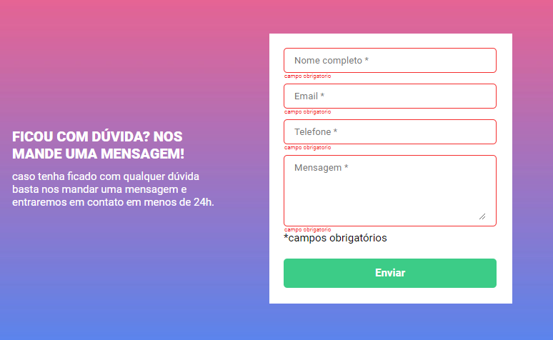

#Este formulário foi criado com HTML, CSS e JavaScript

#É um formulário com validação, os campos são obrigatórios, se não forem preenchidos, aparece uma mensagem de erro e as bordas ficam na cor vermelha.
Se os campos forem preenchidos corretamente as bordas ficarão na cor verde ao clicar no botão de enviar.

#Criei também um layout responsivo bem simples
