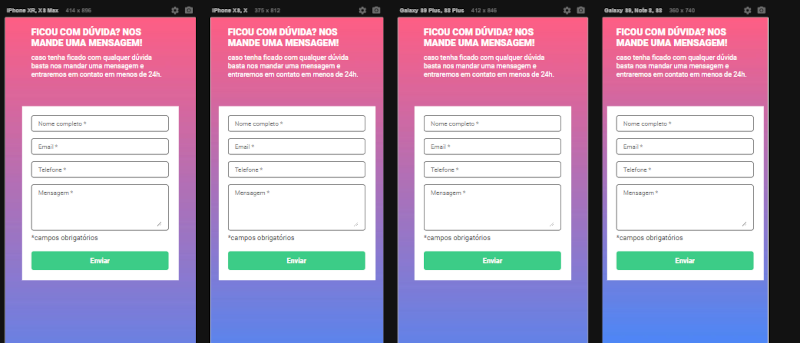

<h1>Formulário</h1>

Este formulário foi criado com HTML, CSS e JavaScript

<h3>clique no link para ver o formulário no GitHub pages.</h3> 

[Formulário JS intermediário](https://karoltoledo.github.io/formulario-js-intermediario/)

 Este formulário inclui validação, tornando obrigatório o preenchimento de todos os campos. Caso algum campo seja deixado em branco, uma mensagem de erro será exibida e as bordas ficarão destacadas em vermelho.
Quando você preencher corretamente todos os campos e clicar no botão 'Enviar', as bordas mudarão de cor para verde, indicando que o envio foi bem-sucedido.

***
<h1> Layout responsivo</h1>

 Criei também um layout responsivo bem simples
 

